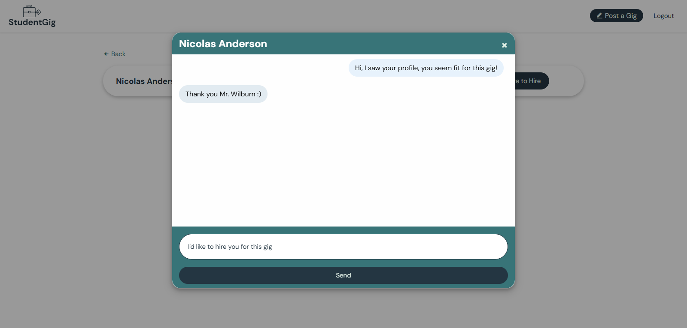

# StudentGig
**StudentGig** is a platform designed to connect college students with short-term, flexible gig opportunities. It streamlines the process for students to find part-time work, internships, and freelance gigs, while offering companies and individuals a straightforward way to post job listings suited for student talent.

With diverse job options, including remote, onsite, and hybrid roles, StudentGig aims to make earning and learning more accessible for students, empowering them to gain valuable experience alongside their studies.

## Tech Stack
- **Frontend:** HTML, CSS, JavaScript
- **Backend:** PHP, MySQL
- **AJAX:** Enables asynchronous requests and seamless user experience
- **PHPMailer:** Supports email notifications and communications
- **Composer:** Manages dependencies for PHP libraries
- **Payment Integration:** PayPal
- **Hosting:** Hostinger

## Screenshots
### Home

### Gig Details

### Student Profile

### Applied Gigs

### Gig Creator Profile

### Post a Gig

### View Applicants

### Chat

### Login

### Signup

## Creator/Founder
**Mark Jason T. Galang**  
I'm passionate about helping college students support themselves through their education, recognizing that college can be expensive. My goal is to create opportunities that allow students to gain valuable work experience while earning income through flexible gig options.